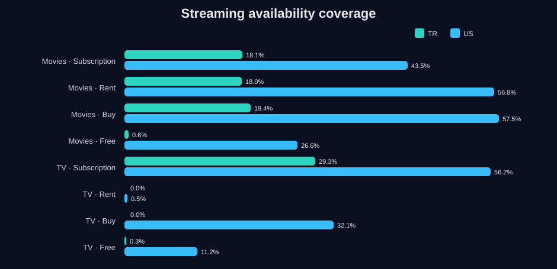

# CineGraph Network Intelligence

**Graph Analytics | Neural Search | Hybrid Recommender Systems | NLP | Knowledge Graphs | RAG-Ready Media Intelligence**

CineGraph Network Intelligence explores the CineGraph TMDB dataset as a connected media graph, not as a flat movie table.

The project now includes **CineGraph AI Explorer**, a Streamlit application designed as an intelligent media discovery prototype. It combines graph analytics, semantic search, hybrid recommendations and explainable recommendation logic for movie, TV and people-network exploration.

## CineGraph AI Explorer

The app is built to answer a practical product question:

> How can a large entertainment catalog become an intelligent discovery layer for recommendations, semantic search, content strategy and RAG-ready media retrieval?

### App modules

1. **Home with catalog KPIs**  
   Executive overview of movies, TV shows, people, reviews, graph coverage and financial genre signals.

2. **Movie / TV search**  
   Search by title, genre, person or description using semantic matching.

3. **Hybrid recommender**  
   Recommendation logic combining semantic similarity, graph proximity, quality signals and business signals.

4. **People and title network exploration**  
   Interactive network view connecting the selected node with recommended nodes and genre signals.

5. **Semantic search by description**  
   Natural-language search for content discovery, using sentence embeddings when available and TF-IDF as an interpretable fallback.

6. **Recommendation explanation**  
   Explains why each recommendation appeared by decomposing semantic, graph, quality and business scores.

## Run locally

```bash
pip install -r requirements.txt
streamlit run app/streamlit_app.py
```

The app works with the derived CSV files already in the repository. If richer title-level files are later added under `data/processed/`, the same app will automatically use them for title-level search and recommendations.

Expected optional processed files:

```text
data/processed/catalog_nodes.csv
data/processed/graph_edges.csv
```

## Current dataset layer

CineGraph contains normalized TMDB-based data for movies, TV shows, people, orphans and reviews.

| Table | Rows | Description |
|---|---:|---|
| Movies | 22,393 | Full movie metadata, financials, cast, recommendations and streaming availability |
| TV Shows | 15,562 | Series metadata, creators, cast, networks, certifications and streaming availability |
| People | 58,393 | Cast, directors, creators and social/profile metadata |
| Orphan Movies | 8,068 | Lightweight movie nodes referenced by recommendation edges |
| Orphan TV | 3,389 | Lightweight TV nodes referenced by recommendation edges |
| Movie Reviews | 22,712 | Text reviews and optional ratings |
| TV Reviews | 2,923 | Text reviews and optional ratings |

## Why this project is different

Previous portfolio projects focused on healthcare, BI, logistics and predictive modeling. This project adds a deeper technical layer:

- graph-first data modeling;
- many-to-many edge extraction from comma-separated IDs;
- entity resolution and relationship coverage analysis;
- co-star collaboration network analysis;
- recommendation graph analysis with orphan node handling;
- semantic search with neural embeddings when available;
- hybrid recommendation logic;
- explainable recommendation scoring;
- RAG-ready thinking for media knowledge retrieval.

## Key graph metrics

| Relationship | Resolved reference coverage |
|---|---:|
| Movie recommendations, main corpus only | 69.7% |
| Movie recommendations, with orphan movies | 100.0% |
| TV recommendations, main corpus only | 99.9% |
| TV recommendations, with orphan TV | 100.0% |
| Movie cast IDs resolved to people | 70.6% |
| Movie director IDs resolved to people | 67.2% |
| TV creator IDs resolved to people | 60.4% |

The orphan tables matter because they prevent graph edges from dangling. This makes the dataset more suitable for recommendation graphs, network analysis and RAG-style entity retrieval.

## Co-star network sample

The graph below uses a high-signal sample of popular/high-vote movies and extracts a co-star network from the top cast lists.


Top people by weighted co-star centrality in this sample include Johnny Depp, Robert De Niro, Brad Pitt, Samuel L. Jackson, Morgan Freeman, Mark Wahlberg, Tom Cruise, Tom Hanks, Dwayne Johnson and Scarlett Johansson.

## Financial analysis by genre

The project also uses the financial columns available in the movie table, including budget, revenue, profit and ROI.


The highest total reported profit is concentrated in large commercial genres such as Adventure, Action, Comedy, Drama and Science Fiction. This part of the project is exploratory and only uses titles where TMDB reports both budget and revenue.

## Streaming market coverage

CineGraph includes watch provider columns for Turkey and the United States, allowing cross-market availability analysis.



The US market shows much broader provider coverage in this dataset, especially for movie rental, movie purchase and TV subscription availability. Turkey has more limited coverage, especially for TV rental and purchase fields.

## Review text mining

The review tables allow lightweight NLP analysis. TF-IDF is used to compare terms overrepresented in low-rated and high-rated reviews.


This analysis can be extended into sentiment classification, topic modeling, aspect extraction or embeddings for semantic retrieval.

## Hybrid recommendation logic

The recommendation layer uses a weighted score:

```text
hybrid_score =
  semantic_weight * semantic_similarity
+ graph_weight    * graph_proximity
+ quality_weight  * rating_signal
+ business_weight * popularity_revenue_roi_signal
```

This makes the recommendation interpretable. The app does not only return a list; it explains whether each result appeared because of semantic similarity, graph proximity, quality or business strength.

## SEO / product positioning

This project is positioned around high-signal keywords for data and AI portfolios:

- graph analytics for media catalogs;
- neural search for movies and TV shows;
- hybrid recommender systems;
- explainable recommendation engine;
- RAG-ready knowledge graph;
- semantic search with sentence embeddings;
- entertainment data intelligence;
- content discovery analytics.

## Methods

1. Loaded normalized CSV files.
2. Validated primary table sizes and schema.
3. Parsed comma-separated ID lists into edge lists.
4. Measured entity resolution coverage for cast, director, creator and recommendation relationships.
5. Added orphan movie/TV nodes to eliminate dangling recommendation edges.
6. Built a co-star network sample with NetworkX.
7. Aggregated financial performance by genre.
8. Compared streaming availability between Turkey and the United States.
9. Applied TF-IDF to review text for interpretable NLP.
10. Added a Streamlit intelligence app for search, hybrid recommendation and graph exploration.
11. Added a neural embedding path using Sentence Transformers when available.

## Files

```text
cinegraph-network-intelligence/
├── README.md
├── app/
│   └── streamlit_app.py
├── .streamlit/
│   └── config.toml
├── assets/
│   ├── chart_graph_integrity.svg
│   ├── chart_costar_network.svg
│   ├── chart_genre_profit.svg
│   ├── chart_streaming_coverage.svg
│   └── chart_review_terms.svg
├── data/
│   ├── executive_summary.csv
│   ├── relationship_coverage.csv
│   ├── genre_financial_summary.csv
│   ├── streaming_coverage.csv
│   ├── low_review_terms.csv
│   ├── high_review_terms.csv
│   └── top_people_network_centrality.csv
├── requirements.txt
└── scripts/
    └── cinegraph_network_analysis.py
```

## Tools and skills demonstrated

| Area | Tools / concepts |
|---|---|
| Graph analytics | NetworkX, edge lists, entity resolution, co-star networks |
| Neural NLP | Sentence Transformers, embeddings, semantic search |
| NLP fallback | TF-IDF, review text mining, interpretable term analysis |
| Recommendation systems | Hybrid scoring, semantic similarity, graph proximity, explainability |
| Data modeling | Normalized tables, many-to-many relationships, orphan node handling |
| Product analytics | Catalog discovery, content strategy, streaming coverage, financial signals |
| Visualization | Streamlit, Plotly, Matplotlib/SVG charts |
| RAG readiness | Entity-centered schema, graph links, metadata-rich retrieval design |

## Limitations

- The graph is built from TMDB metadata and reflects availability and quality of that source.
- Some person relationships do not resolve to `people.csv`, especially for TV creators and minor credits.
- Reviews are multilingual and unevenly distributed, so NLP results should be interpreted as exploratory.
- Financial analysis only uses movies with both budget and revenue available.
- The current app can run from derived repository outputs; full title-level recommendation quality improves when `data/processed/catalog_nodes.csv` is added.

## Next steps

- Deploy the app on Streamlit Community Cloud.
- Build `data/processed/catalog_nodes.csv` from full title-level metadata.
- Create embeddings from overviews, biographies and reviews.
- Build a persistent FAISS vector index.
- Add Node2Vec or GraphSAGE embeddings for graph-native recommendation.
- Build a Neo4j version for full graph querying.
- Create a RAG prototype for natural-language questions over movie, TV and people relationships.
